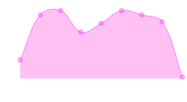

# MMM-InfluxChart
Chart module for [MagicMirror²](https://github.com/MichMich/MagicMirror). This module reads data serie from the InfluxDB and di
splays it with [Chart.js](http://www.chartjs.org/) chart.

This module was built on top of the [MMM-Chart](https://github.com/evghenix/MMM-Chart) by [Evghenii Marinescu](https://github.com/evghenix) and as such contains some parts of its code or very similar code.



## Requirements
* [Node.js](https://nodejs.org/en/download/)

## Installation
In short, clone the repository to your MagicMirror modules directory and run `npm install` inside the module folder to install the dependencies.

These commands show bit of example of how it could be done, you should modify them to match your own MagicMirror path.

1. In your terminal, go to your MagicMirror module folder
    ```bash
    cd MagicMirror/modules
    ```

2. Clone the repository
    ```bash
    git clone git@github.com:mireiawen/MMM-InfluxChart.git
    ```

3. Install the dependencies
    ```bash
    cd MagicMirror/modules/MMM-InfluxChart
    npm install
    ```
## Configuring the module
To use this module, add it to the modules array in the `config/config.js` file, for example:
```javascript
modules: [
    ...
    {
      module: "MMM-InfluxChart",
      position: "bottom_left",
      header: "Magic Chart",
      config: {
        url: "http://influxdb.localdomain/",
        database: "magic_mirror",
        query: 'SELECT "magic_value" FROM "magic_data" WHERE Time > now()-3h AND Time < now()+6h',
        width: 300,
        height: 150,
        xLabelVisible: false,
        yLabel: "magic/s"
      }
    },
]
```
### Configuration options
| Option            | Type   | Description                                | Default value              |
| ------------------|--------|--------------------------------------------|----------------------------|
| `width`           | int    | Chart width in pixels                      | `200`                      |
| `height`          | int    | Chart height in pixels                     | `200`                      |
| `ariaLabel`       | string | Chart label for screen readers             | `'Data Chart'`             |
| `xLabel`          | string | Label for the X axis                       | `'date'`                   |
| `xLabelVisible`   | bool   | Should the label for the X axis be visible | `true`                     |
| `yLabel`          | string | Label for the Y axis                       | `''`                       |
| `yLabelVisible`   | bool   | Should the label for the X axis be visible | `true`                     |
| `chartType`       | string | The chart type to create                   | `'line'`                   |
| `url`             | string | The InfluxDB API URL                       | `'http://localhost:8086/'` |
| `database`        | string | The InfluxDB database to query             | `'magicmirror'`            |
| `query`           | string | The query to run in the InfluxDB           | `''`                       |
| `dateTimeFormat`  | string | The format for the X axis time stamps      | `'HH:mm'`                  |
| `backgroundColor` | string | The chart background fill color, HTML code | `'rgba(255, 0, 200, 0.3)'` |
| `borderColor`     | string | The chart line color, HTML code            | `'rgba(255, 0, 255, 0.6)'` |
| `borderWidth`     | int    | The chart line width, in pixels            | `1`                        |
| `labelFontColor`  | string | The label text font color, HTML code       | `'#999'`                   |
| `labelFontSize`   | int    | The label text font size                   | `15`                       |
| `labelFontFamily` | string | The label text font family                 | `'"Roboto Condensed", Arial, Helvetica, sans-serif'` |
| `labelLineHeight` | string | The label text line height                 | `'15px'`                   |
